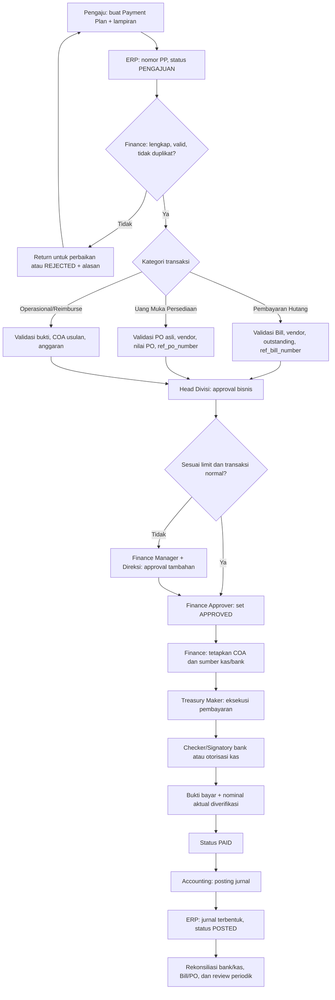

# SOP Keuangan dan Flow Otorisasi Payment Plan

| Informasi | Ketentuan |
|---|---|
| Dokumen | SOP Keuangan dan Flow Otorisasi Payment Plan |
| Berlaku untuk | Pengeluaran kas kecil, kas besar, bank, reimbursement, pembayaran hutang, dan uang muka pembelian persediaan |
| Sistem | ERP PT. Magicase Group Indonesia — modul **Payment Plan** |
| Status | Draf operasional berbasis proses ERP saat ini |
| Pemilik proses | Finance & Accounting |
| Peninjauan | Minimal tahunan atau saat ada perubahan otorisasi/COA/proses bank |

> **Catatan status implementasi.** Dokumen ini membedakan proses yang sudah tersedia di ERP (*as-is*) dan kontrol yang wajib diberlakukan sebagai kebijakan. Matriks nominal, jabatan pemegang limit, dan pemisahan akses per peran **belum dikonfigurasi sebagai aturan sistem**. Nilai limit pada matriks harus disahkan Direksi/Manajemen sebelum SOP diberlakukan.

---

## 1. Tujuan

1. Memastikan setiap pengeluaran memiliki kebutuhan bisnis, bukti yang memadai, akun akuntansi yang benar, dan otorisasi sesuai limit.
2. Memisahkan fungsi pengaju, pemeriksa, penyetuju, pelaksana pembayaran, dan pencatat jurnal.
3. Menjaga keterlacakan dari Payment Plan (PP) ke bukti, Bill/PO, jurnal umum, serta laporan keuangan.
4. Mencegah pembayaran ganda, pembayaran tanpa referensi, dan perubahan data setelah jurnal diposting.

## 2. Ruang Lingkup dan Definisi

### 2.1 Ruang lingkup

SOP mencakup transaksi yang dibuat lewat **Payment Plan**, baik dari portal karyawan `/form-pengajuan` maupun input internal `/payment-plan`:

- kas kecil, kas besar, dan bank;
- biaya operasional dan reimbursement;
- **PEMBAYARAN HUTANG** yang harus merujuk Purchase Bill; serta
- **PEMBELIAN PERSEDIAAN (UANG MUKA)** yang harus merujuk Purchase Order (PO).

### 2.2 Definisi status

| Status | Arti operasional | Boleh dilakukan berikutnya |
|---|---|---|
| `PENGAJUAN` | Permintaan telah masuk, belum disetujui. | Verifikasi, perbaikan, tolak, atau approval. |
| `APPROVED` | Kebutuhan dan limit telah disetujui. Belum berarti uang telah dibayar. | Penetapan COA/rekening, eksekusi pembayaran. |
| `REJECTED` | Permintaan ditolak. | Ditutup; pengajuan baru bila diperlukan. |
| `PAID` | Bank/kas telah dieksekusi dan bukti bayar telah diperoleh. | Verifikasi bukti dan posting jurnal. |
| `POSTED` | Jurnal umum telah terbentuk dari PP; status final akuntansi. | Rekonsiliasi, koreksi melalui reversal sesuai kebijakan; tidak diedit/dihapus biasa. |

`PAID` dan `POSTED` **bukan status yang sama**: `PAID` membuktikan kas/bank telah keluar, sedangkan `POSTED` membuktikan dampak akuntansinya telah dicatat.

### 2.3 Nomor dan dokumen sumber

- ERP menghasilkan `no_transaksi` PP unik dengan pola `MMYY.KODE_DIVISI.KODE_JENIS.TGL.URUTAN`.
- Bukti pendukung disimpan pada detail PP sebagai `bukti_file` (JPG/JPEG/PNG/PDF, maksimum 5 MB per berkas menurut validasi form).
- Jurnal PP memakai ID teknis deterministik dari nomor PP. No. Bukti internal jurnal
  dibuat otomatis dengan format `PP-YYYYMMDD-XXXX`, sedangkan nomor PP asli tetap
  dicatat sebagai No. Transaksi pada `source_doc_no`.

---

## 3. Peran dan Pemisahan Tugas

| Peran | Tanggung jawab utama | Larangan minimum |
|---|---|---|
| Pengaju/PIC | Mengajukan kebutuhan, memasukkan detail, rekening penerima, dan bukti awal. | Tidak menyetujui atau membayar pengajuannya sendiri. |
| Atasan/Head Divisi | Memastikan kebutuhan, anggaran, dan kepentingan divisi. | Tidak menjadi pelaksana bank untuk pengajuan yang ia setujui sendiri. |
| Finance Verifikator | Memeriksa kelengkapan, nominal, vendor, referensi Bill/PO, kategori, dan COA usulan. | Tidak melakukan approval limit final dan pembayaran untuk PP yang sama. |
| Finance Manager/Approver | Menyetujui sesuai limit, memastikan sumber dana dan periode. | Tidak mengubah bukti/nilai setelah menyetujui tanpa re-approval. |
| Treasury/Kasir/Maker Bank | Menyiapkan dan menjalankan pembayaran setelah PP approved. | Tidak meng-approve PP yang dibayarkan. |
| Checker/Signatory Bank | Mengotorisasi transaksi bank sesuai mandat bank. | Tidak menjadi maker untuk transaksi yang sama. |
| Accounting | Memastikan COA, nominal aktual, jurnal, dan rekonsiliasi. | Tidak mem-posting pembayaran tanpa bukti bayar tervalidasi. |
| Direksi | Approval transaksi di atas limit/bersifat luar biasa dan penetapan matriks. | Tidak menggantikan bukti atau kontrol Finance. |
| Admin Sistem | Mengelola akses, master COA, dan audit log. | Tidak memproses transaksi keuangan operasional. |

**Prinsip wajib:** minimal berlaku *four-eyes principle*: pengaju ≠ approver, maker bank ≠ checker bank, dan pembayaran ≠ pihak yang merekonsiliasi bila personel memungkinkan.

---

## 4. Matriks Otorisasi

### 4.1 Matriks yang harus disahkan

Isi batas berikut dalam rupiah melalui SK Direksi/Manajemen. Sampai diisi, seluruh transaksi diperlakukan sebagai transaksi yang memerlukan Head Divisi + Finance Manager + Direksi.

| Nilai nominal aktual per PP | Persetujuan bisnis | Persetujuan keuangan | Otorisasi akhir |
|---|---|---|---|
| `≤ Limit 1: Rp __________` | Head Divisi | Finance Supervisor/Manager | Sesuai mandat bank/kasir |
| `> Limit 1 s.d. Limit 2: Rp __________` | Head Divisi | Finance Manager | Direksi/pejabat berwenang |
| `> Limit 2: Rp __________` | Head Divisi | Finance Manager | Direksi sesuai mandat |
| Transaksi luar kebiasaan, pihak berelasi, perubahan rekening vendor, atau tanpa PO/Bill | Head Divisi | Finance Manager | Direksi, tanpa melihat nominal |

### 4.2 Ketentuan limit

1. Dasar limit adalah **nominal aktual efektif**: `nominal_aktual` bila telah diisi, atau nominal pengajuan bila aktual belum tersedia.
2. Dilarang memecah satu kebutuhan/transaksi menjadi beberapa PP untuk menghindari limit.
3. Bila nominal aktual lebih tinggi dari nominal yang disetujui, PP harus kembali ke tahap approval sesuai total aktual.
4. Perubahan vendor, rekening tujuan, kategori, COA, Bill/PO, atau tujuan penggunaan setelah approval mewajibkan pembatalan approval dan approval ulang.

---

## 5. Prosedur Operasional

### 5.1 Pengajuan

1. Pengaju membuat PP melalui portal karyawan atau menu Payment Plan internal.
2. Pengaju wajib mengisi tanggal pengajuan, tanggal transaksi, divisi, jenis transaksi, kategori, vendor/toko, PIC, rekening/VA, detail item, nominal, dan keterangan.
3. Pengaju melampirkan dokumen yang relevan: quotation/invoice, bukti kebutuhan, surat tugas, PO/Bill, atau bukti reimbursement.
4. Sistem membuat PP dengan status `PENGAJUAN`; nomor PP harus dicantumkan pada komunikasi dan bukti terkait.
5. Pengaju tidak boleh mengajukan data fiktif, rekening pribadi yang tidak berhak, atau mengganti rekening vendor tanpa verifikasi independen.

### 5.2 Verifikasi Finance

Finance Verifikator memeriksa dan mendokumentasikan hasil pemeriksaan berikut sebelum PP diteruskan ke approval:

- kelengkapan lampiran dan alasan bisnis;
- kesesuaian divisi, penerima/PIC, tanggal transaksi, jatuh tempo, dan sumber dana;
- kewajaran detail, quantity, harga satuan, total, serta adanya PP/Bill/PO duplikat;
- validitas vendor dan rekening tujuan. Perubahan rekening vendor harus dikonfirmasi lewat kanal independen yang telah dikenal, bukan hanya berdasarkan email/chat permintaan;
- ketepatan kategori dan COA usulan;
- ketersediaan anggaran bila proses anggaran sudah ditetapkan;
- kesesuaian nominal aktual dengan bukti untuk reimbursement.

Hasilnya adalah: (a) dikembalikan untuk perbaikan, (b) ditolak, atau (c) direkomendasikan untuk approval. Alasan penolakan/perbaikan wajib tercatat di log/catatan kerja Finance.

### 5.3 Perlakuan khusus berdasarkan kategori

#### A. Pembayaran Hutang

1. Finance wajib memilih/mengisi `ref_bill_number` yang merujuk `purchase_bills.bill_number` milik vendor yang sama.
2. Sebelum bayar, cocokkan Bill, PO/penerimaan bila ada, invoice vendor, dan nilai outstanding.
3. Akun debit jurnal adalah **Hutang Usaha**; ERP telah memaksa akun ini saat kategori memuat `PEMBAYARAN HUTANG`.
4. Setelah posting PP berhasil, ERP menandai `purchase_bills.payment_status` menjadi `PAID`. Finance tetap wajib memastikan nilai yang dibayar memang penuh; pembayaran parsial membutuhkan prosedur/alokasi khusus dan tidak boleh langsung menandai Bill lunas.

#### B. Uang Muka Pembelian Persediaan

1. Finance wajib mengisi `ref_po_number` yang merujuk PO asli, bukan PO sintetis jika PO asli tersedia.
2. Pembayaran uang muka dipastikan terkait vendor, barang, nilai PO, dan syarat pembayaran yang disetujui.
3. Saat penerimaan barang, alur PO menggunakan akun **Uang Muka** sebagai kredit, bukan Hutang Usaha, sesuai referensi uang muka pada PP/PO.
4. Jika belum ada PO resmi, transaksi hanya boleh berjalan sebagai pengecualian dengan persetujuan Direksi dan PO wajib diselesaikan paling lambat sebelum penerimaan barang.

#### C. Operasional, kas kecil, kas besar, dan reimbursement

1. Finance menetapkan akun biaya/aset yang sesuai master COA dan memastikan bukti perpajakan bila diperlukan.
2. Reimbursement memerlukan bukti pengeluaran asli, tanggal, tujuan bisnis, dan persetujuan atasan.
3. Kas kecil digunakan sesuai plafon kas kecil; transaksi di atas plafon harus dibayar melalui bank atau mekanisme yang disetujui.

### 5.4 Approval

1. Approver memeriksa rekomendasi Finance, justifikasi bisnis, kelengkapan, nominal, dan limitnya.
2. Approver menyetujui dengan status `APPROVED`, atau menolak dengan status `REJECTED` dan alasan yang dapat ditelusuri.
3. Approval harus dicatat per orang, tanggal/waktu, jabatan/peran, keputusan, dan alasan. Bila ERP belum menyimpan metadata tersebut per PP, catat pada register approval yang dikendalikan Finance sampai fitur tersedia.
4. Setelah status `APPROVED`, pengajuan tidak boleh diedit kecuali dikembalikan ke `PENGAJUAN` dan disetujui ulang.

### 5.5 Penetapan rekening sumber dan COA

1. Finance menetapkan jenis sumber pembayaran pada PP: kas atau bank, sesuai ketersediaan dana dan mandat bank.
2. Finance menetapkan `id_akun`/COA untuk pengeluaran non-hutang; COA harus berasal dari master akun aktif.
3. Untuk pembayaran hutang, COA debit ditentukan sistem sebagai Hutang Usaha; jangan gunakan akun biaya bebas.
4. Validasi bank dilakukan oleh maker/checker melalui rekening sumber perusahaan yang sah. Pengaju tidak boleh menentukan rekening sumber perusahaan.

### 5.6 Pelaksanaan pembayaran

1. Treasury/Kasir hanya memproses PP berstatus `APPROVED` yang telah lolos pengecekan Finance dan memiliki COA serta rekening tujuan yang valid.
2. Maker bank menyiapkan transfer; checker/signatory bank menyetujui sesuai mandat bank dan matriks otorisasi.
3. Untuk kas, kasir menyerahkan dana kepada penerima yang berwenang dan memperoleh tanda terima.
4. Treasury mengunggah bukti transfer/tanda terima dan mengisi nominal aktual bila berbeda dari nominal pengajuan.
5. Setelah bukti tervalidasi, Finance mengubah status menjadi `PAID`.

### 5.7 Posting jurnal dan penutupan akuntansi

1. Accounting hanya memilih PP `PAID` yang telah diverifikasi untuk aksi **Posting Jurnal**.
2. Sistem membentuk jurnal dua sisi dengan nilai `nominal_aktual` jika tersedia, atau nominal pengajuan sebagai fallback:

   | Jenis PP | Debit | Kredit |
   |---|---|---|
   | Operasional/reimbursement | COA biaya/aset yang disetujui | Kas atau Bank sesuai jenis transaksi |
   | Pembayaran Hutang | Hutang Usaha | Kas atau Bank |
   | Uang muka pembelian | Akun uang muka sesuai mapping COA | Kas atau Bank |

3. ERP memiliki pengaman ID jurnal deterministik dan pemeriksaan jurnal yang sudah ada; PP yang telah `POSTED` tidak boleh diposting ulang.
4. Setelah jurnal berhasil terbentuk, ubah PP menjadi `POSTED`, simpan nomor jurnal, dan lakukan pengecekan saldo debet = kredit.
5. Jurnal `POSTED` tidak boleh dihapus untuk koreksi biasa. Koreksi harus melalui jurnal reversal dan PP koreksi yang menyimpan alasan serta rujukan ke dokumen awal.

---

## 6. Flow Otorisasi

---

## 7. Pengendalian Perubahan, Penolakan, dan Pengecualian

1. PP `REJECTED` tidak boleh diaktifkan kembali tanpa pengajuan/approval baru.
2. Bila bukti belum lengkap, status tetap `PENGAJUAN`; jangan diberi status `APPROVED` bersyarat tanpa daftar kekurangan dan batas waktu yang disetujui Finance Manager.
3. Bila transaksi sudah `PAID` tetapi belum dapat diposting (misalnya COA salah), Finance membuka tiket koreksi, memperbaiki master/data dengan persetujuan Accounting, lalu mem-posting. Bukti pembayaran tidak boleh dihapus.
4. Bila salah bayar, Treasury segera menghubungi bank/vendor, Finance Manager diberi tahu pada hari yang sama, dan Accounting membuat pencatatan piutang/koreksi sementara sesuai fakta transaksi.
5. Penghapusan PP yang telah `PAID`/`POSTED` dilarang secara prosedural. Gunakan reversal. Hal ini penting karena implementasi saat ini masih menyediakan aksi hapus yang dapat menghapus jurnal terkait.
6. Pengecualian harus berisi alasan, risiko, nominal, pihak yang menyetujui, tindakan mitigasi, dan batas waktu penyelesaian.

---

## 8. Rekonsiliasi dan Monitoring

| Frekuensi | Pelaksana | Pemeriksaan |
|---|---|---|
| Harian | Finance/Treasury | PP `APPROVED` belum dibayar, PP jatuh tempo, bukti bayar, dan transaksi gagal. |
| Mingguan | Accounting | PP `PAID` yang belum `POSTED`, PP `POSTED` tanpa bukti, duplikasi nomor Bill/PO, dan perubahan rekening vendor. |
| Bulanan | Accounting + Finance Manager | Rekonsiliasi PP terhadap mutasi bank/kas, jurnal umum, Purchase Bill, PO/uang muka, dan laporan AP. |
| Bulanan | Finance Manager | Tinjau `SystemLog` untuk aksi CREATE/UPDATE/POST/DELETE Payment Plan dan sampel kepatuhan matriks approval. |
| Tahunan | Direksi + Finance | Tinjau limit, mandat bank, peran, akses pengguna, COA, dan efektivitas SOP. |

**Daftar pengecekan penutupan bulan:**

- Tidak ada PP `PAID` tanpa jurnal atau PP `POSTED` tanpa jurnal yang seimbang.
- Semua PP pembayaran hutang `POSTED` mempunyai `ref_bill_number` yang valid dan status Bill telah direkonsiliasi.
- Semua uang muka `POSTED` mempunyai `ref_po_number` PO asli bila tersedia serta dapat ditelusuri saat penerimaan barang.
- Nominal aktual dan selisih pengajuan telah dijelaskan dan memperoleh re-approval bila melewati limit.
- Bukti transfer/tanda terima dapat diakses dan dikaitkan dengan nomor PP.

---

## 9. Kondisi ERP Saat Ini dan Tindak Lanjut Wajib

| Kontrol | Kondisi saat ini | Tindak lanjut sebelum penerapan penuh |
|---|---|---|
| Pengajuan | Ada via portal publik (rate-limit) dan form internal; awalnya `PENGAJUAN`. | Portal perlu identifikasi pengaju yang lebih kuat bila dipakai untuk transaksi material. |
| Referensi Bill/PO | Tersedia `ref_bill_number` dan `ref_po_number`; validasi Bill dilakukan saat posting hutang. | Jadikan referensi wajib sejak verifikasi/approval, bukan hanya pada saat posting. |
| Approval | Status dapat diubah ke `APPROVED`, `REJECTED`, `PAID`, atau `POSTED`. | Terapkan state-transition, approval berjenjang, metadata approver, dan alasan keputusan. |
| RBAC | Route Payment Plan memakai autentikasi, tetapi belum ada pembatasan aksi per peran pada alur ini. | Batasi create, verify, approve, set-COA, set-rekening, pay, post, edit, delete per permission. |
| Posting | Jurnal dibuat dari PP, memakai nominal aktual efektif dan pengaman ID deterministik. | Batasi posting hanya untuk `PAID` dan validasi bukti bayar/approval di server. |
| Penghapusan | Aksi hapus masih dapat menghapus jurnal/PO turunan pada kondisi tertentu. | Nonaktifkan hapus untuk `PAID`/`POSTED`; sediakan reversal ber-audit. |
| Pembayaran Bill | Posting mengubah status Bill menjadi `PAID`. | Tambahkan allocation/outstanding untuk pembayaran parsial agar tidak salah melunasi Bill. |
| Audit trail | `SystemLog` mencatat aksi, pengguna login, dan IP. | Tambahkan log perubahan field, keputusan approval, lampiran, dan jejak maker/checker bank per PP. |

## 10. Referensi Teknis ERP

Dokumen ini disusun dari alur aktif di repository berikut:

- `app/Http/Controllers/PaymentPlanController.php` — pembuatan PP, status, COA, rekening sumber, dan posting jurnal.
- `app/Models/PaymentPlan.php` serta `transaksi_payment_plan_detail` — header/detail, nominal aktual, dan lampiran.
- `routes/web.php` — portal publik dan endpoint Payment Plan internal yang dilindungi autentikasi.
- `PAYMENT_PLAN_FIX_SUMMARY.md` — referensi Bill/PO, proteksi jurnal, dan pembaruan status Bill.
- `FLOW_ANALYSIS_REPORT.md` dan `PRD.md` — keterkaitan PP dengan PO, Purchase Bill, jurnal, persediaan, dan laporan.
